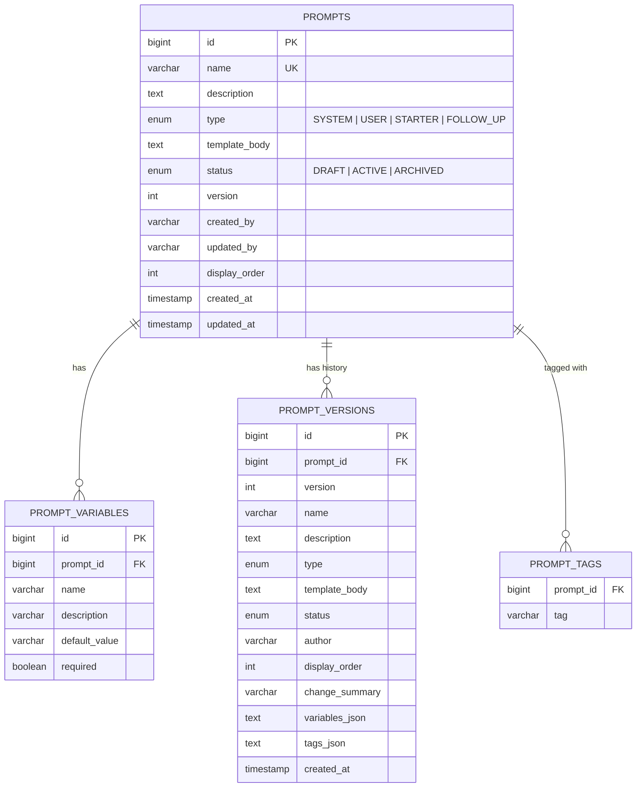

# Prompt Library Management System

A full-stack application for managing, versioning, and rendering AI agent prompt templates. Create, organize, version-control, and test your prompts with a live preview and template rendering engine.

## Tech Stack

| Layer | Technology |
|-------|-----------|
| **Backend** | Spring Boot 3.4.3, Java 17+, Spring Data JPA |
| **Frontend** | React 19, TypeScript, Vite, Tailwind CSS 4 |
| **Database** | H2 (in-memory) |
| **API Contract** | OpenAPI 3.0 with code generation (interface-first) |
| **Build** | Maven (backend), npm (frontend) |

## Prerequisites

- Java 17+
- Maven 3.9+
- Node.js 18+
- npm 9+

## Setup & Run Instructions

```bash
git clone https://github.com/saiteja-konda2026/prompt-library-management-system.git
cd prompt-library-management-system
```

### Backend (Terminal 1)

```bash
cd backend
mvn clean install
mvn spring-boot:run
```

The API starts on `http://localhost:8080`.

### Frontend (Terminal 2)

```bash
cd frontend
npm install
npm run dev
```

The UI starts on `http://localhost:3000`.

### Running Tests

```bash
cd backend
mvn test
```

### H2 Console

Access the in-memory database at `http://localhost:8080/h2-console`:

| Field | Value |
|-------|-------|
| JDBC URL | `jdbc:h2:mem:promptdb` |
| Username | `sa` |
| Password | *(empty)* |

## Design Decisions & Trade-offs

- **OpenAPI-first development** — Controllers implement generated Java interfaces (`PromptsApi`, `OperationsApi`, `VersioningApi`), ensuring the implementation always matches the contract. DTOs are auto-generated from the spec.

- **Snapshot-based versioning** — For storing the older versions of prompt templates, I use a hybrid versioning approach: current/live prompt data is normalized in relational tables for fast filtering and edits, while version history is stored as immutable snapshots. In a fully normalized history model, every new versioned child collection (e.g., prompt_examples) would require additional history tables (e.g., prompt_version_examples). To reduce schema churn and simplify rollback/version retrieval, I store versioned collections like tags and variables as JSON in the prompt_versions table.

- **ARCHIVED prompts** — There was no clear instruction if the archived records should be displayed or not. For now, I display them in the main table as view-only records. I could see a future where we would like to revive them, so I provided a clone functionality there so an ARCHIVED record can be reused.

- **Status workflow** — Prompts follow a strict lifecycle: `DRAFT → ACTIVE → ARCHIVED`. There was no clear instructions on how to handle "save on DRAFT templates" or how they become active. Thus, I created a "DRAFT to DRAFT" (save draft button) and "DRAFT to ACTIVE" (save button) workflows that don't create any new versions in the Database. A new version is created only when an ACTIVE prompt template is edited.

- **Simple template engine** — Uses regex-based `{{variable}}` substitution rather than a full templating library (Mustache, Thymeleaf, etc.). This is intentionally lightweight — the use case only requires simple variable replacement, and the regex approach avoids extra dependencies.

- **Centralized error handling** — A `GlobalExceptionHandler` maps all exceptions to a consistent `ErrorResponse` DTO with `message`, `code`, and `details` fields.

- **GET prompt variables API** - The requirement said "GET	/api/prompts/{id}/variables	Extract and return declared {{variables}} from the template body" but we already are storing the variables in the DB. Instead of extracting them from template body, I return the variables associated with the template directly from the Database


## Entity-Relationship Diagram



## API Documentation

The full OpenAPI spec is at [`backend/src/main/resources/api/openapi.yaml`](backend/src/main/resources/api/openapi.yaml).

### Prompts (Core CRUD & Search)

| Method | Path | Description |
|--------|------|-------------|
| `GET` | `/api/prompts` | List prompts with filtering and pagination |
| `POST` | `/api/prompts` | Create a new prompt |
| `GET` | `/api/prompts/{id}` | Get prompt details |
| `PUT` | `/api/prompts/{id}` | Update prompt (creates version snapshot for active prompts) |
| `DELETE` | `/api/prompts/{id}` | Archive prompt (soft delete) |
| `GET` | `/api/prompts/{id}/variables` | Get declared variables for a prompt |

**Query parameters for `GET /api/prompts`:**

| Parameter | Type | Default | Description |
|-----------|------|---------|-------------|
| `type` | string | — | Filter by type (`SYSTEM`, `USER`, `STARTER`, `FOLLOW_UP`) |
| `status` | string | — | Filter by status (`DRAFT`, `ACTIVE`, `ARCHIVED`) |
| `tags` | string[] | — | Filter by tags (comma-separated) |
| `search` | string | — | Search in name, description, and template body |
| `page` | integer | `0` | Page number (zero-based) |
| `size` | integer | `20` | Page size |

### Versioning

| Method | Path | Description |
|--------|------|-------------|
| `GET` | `/api/prompts/{id}/versions` | Get version history |
| `POST` | `/api/prompts/{id}/rollback/{versionId}` | Rollback to a specific version |

### Operations

| Method | Path | Description |
|--------|------|-------------|
| `POST` | `/api/prompts/render` | Render a template string with variable values |


## Pending Items

- In the interest of time, I had to skip following 
  - "Starter Prompt Manager" in both backend and frontend
  - "POST	/api/prompts/{id}/clone	Duplicate a prompt with a new name (resets to v1, DRAFT)". This clone functionality is currently added to the UI but it uses the "POST:/api/prompts" endpoint to create a clone
  - I didn't fully understand the concept of "change summary" and it felt like good to have feature that can be implemented later on
  - Support simple conditional blocks: {{#variable}}content shown if variable is non-empty{{/variable}}

## What I Would Improve Given More Time

- **Use an actual Database** — Replace H2 with a persistent database for production use
- **Authentication & authorization** — we need it so that different user groups have different type of permissions. For instance, only ADMINs should be able to archive prompt templates
- **Docker** — Containerized deployment with docker-compose (backend + frontend + database)
- **Frontend tests** — Unit and integration tests with Vitest + React Testing Library
- **Handle parallel edits** - I'd confirm the requirement in this scenario, and research on how we can achieve this similar to how google docs does it
- **Bulk Archive** - I can think of future scenarios where we'd want to archive a bunch of prompt templates at once
- **UI Enhancements** - 
  - Save button can be disabled if there are no new edits to any of the fields in template
  - Hitting save without filling the required fields should highlight the required fields
